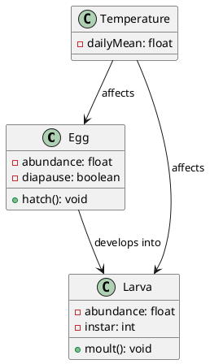
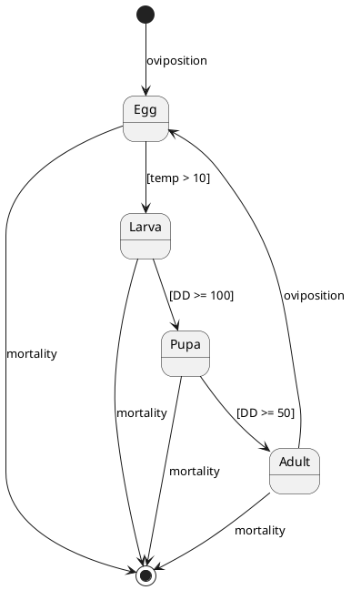

# Supplementary Material S2: UML-Lite Quick Start Guide

## A Minimal UML Approach for Ecological Modelers

---

## Introduction

This guide provides a streamlined introduction to UML for ecologists who want to improve model documentation without extensive software engineering training. The "UML-lite" approach focuses on two essential diagram types that provide maximum benefit with minimal learning investment.

---

## Why UML-Lite?

| Traditional Approach | UML-Lite Approach |
|---------------------|-------------------|
| Narrative text descriptions | Structured diagrams + brief text |
| Implicit assumptions | Explicit, visible assumptions |
| Difficult to compare models | Side-by-side visual comparison |
| No standard format | Standardized notation |

**Time investment:** 2-4 hours to learn UML-lite basics

---

## The Two Essential Diagrams

### 1. Class Diagram: "What exists in your model?"

The class diagram shows the **components** of your model and their **relationships**.

#### Basic Notation

```
┌─────────────────┐
│   ClassName     │  ← Name of component
├─────────────────┤
│ - attribute1    │  ← Properties (variables)
│ - attribute2    │     "-" means private
├─────────────────┤
│ + operation1()  │  ← Behaviors (functions)
│ + operation2()  │     "+" means public
└─────────────────┘
```

#### Relationship Symbols

| Symbol | Meaning | Example |
|--------|---------|---------|
| `───>` | Association (uses) | Larva uses Temperature |
| `◇───` | Aggregation (has) | BreedingSite has Eggs |
| `◆───` | Composition (contains) | Environment contains Temperature |
| `△` | Inheritance (is-a) | Larva is-a LifeStage |
| `...>` | Dependency (affects) | Larvicide affects Larva |

#### Minimal Example: Simple Mosquito Model

```
┌─────────────────┐      ┌─────────────────┐
│    LifeStage    │      │   Temperature   │
├─────────────────┤      ├─────────────────┤
│ - abundance     │◄─────│ - dailyMean     │
│ - devRate       │      │ - dailyMax      │
│ - mortRate      │      └─────────────────┘
└────────△────────┘
         │
    ┌────┴────┬─────────┐
    │         │         │
┌───┴───┐ ┌───┴───┐ ┌───┴───┐
│  Egg  │ │ Larva │ │ Adult │
└───────┘ └───────┘ └───────┘
```

**What this tells us:**
- Three life stages exist (Egg, Larva, Adult)
- All stages share common properties (abundance, devRate, mortRate)
- Temperature affects all life stages

---

### 2. State Machine Diagram: "How does your model change over time?"

The state machine shows **states** (conditions) and **transitions** (changes between states).

#### Basic Notation

```
    ●              ← Initial state (filled circle)
    │
    ▼
┌─────────┐
│ State1  │        ← State (rounded rectangle)
└────┬────┘
     │ [condition]  ← Guard (when transition occurs)
     │ / action     ← Action (what happens)
     ▼
┌─────────┐
│ State2  │
└────┬────┘
     │
     ▼
    ◉              ← Final state (circled dot)
```

#### Minimal Example: Mosquito Life Cycle

```
        ●
        │ oviposition
        ▼
    ┌───────┐
    │  Egg  │
    └───┬───┘
        │ [temp > 10°C]
        ▼
    ┌───────┐
    │ Larva │──────────┐
    └───┬───┘          │
        │ [DD ≥ 100]   │ mortality
        ▼              ▼
    ┌───────┐         ◉
    │ Pupa  │
    └───┬───┘
        │ [DD ≥ 50]
        ▼
    ┌───────┐
    │ Adult │─────┐
    └───┬───┘     │
        │         │ oviposition
        └─────────┘
```

**What this tells us:**
- Life proceeds: Egg → Larva → Pupa → Adult → (lays eggs)
- Hatching requires temperature > 10°C
- Development tracked by degree-days (DD)
- All stages can die (transition to final state)

---

## PlantUML: Making Diagrams from Text

PlantUML lets you create diagrams by writing simple text. This enables:
- Version control (track changes with Git)
- Easy sharing and collaboration
- Reproducible figures

### Class Diagram in PlantUML



### State Machine in PlantUML



### Rendering Diagrams

**Option 1: Online (no installation)**
- Go to: https://www.plantuml.com/plantuml/
- Paste your code
- Download the image

**Option 2: VS Code extension**
- Install "PlantUML" extension
- Preview diagrams as you type

**Option 3: Command line**
```bash
java -jar plantuml.jar mydiagram.puml
```

---

## Checklist: Creating Your First UML-Lite Model

### Class Diagram Checklist

- [ ] List all model components (state variables, drivers, interventions)
- [ ] For each component, list key attributes (properties)
- [ ] For each component, list key operations (behaviors)
- [ ] Draw inheritance relationships (is-a)
- [ ] Draw associations (affects, uses, contains)
- [ ] Add notes to explain non-obvious relationships

### State Machine Checklist

- [ ] Identify all possible states in your model
- [ ] Mark the initial state(s)
- [ ] Mark terminal states (death, removal)
- [ ] Draw transitions between states
- [ ] Add guards: when does each transition occur?
- [ ] Add actions: what happens during transition?

---

## Common Mistakes to Avoid

| Mistake | Problem | Solution |
|---------|---------|----------|
| Too much detail | Diagram becomes unreadable | Focus on essential structure |
| Missing relationships | Unclear how components interact | Review each pair of components |
| Vague guards | Unclear when transitions occur | Use specific conditions |
| No initial/final states | Unclear where system starts/ends | Always include entry/exit points |
| Inconsistent naming | Confusion between diagrams | Use same names everywhere |

---

## From UML-Lite to Full Framework

Once comfortable with UML-lite, consider adding:

| Level | Diagrams | When to Use |
|-------|----------|-------------|
| **Tier 1 (UML-Lite)** | Class + State Machine | Basic documentation |
| **Tier 2 (Standard)** | + Activity + Sequence | Formal specification, code generation |
| **Tier 3 (Advanced)** | + OCL constraints, CI/CD | Regulatory models, team projects |

---

## Quick Reference Card

### Class Diagram Symbols
```
┌─────────┐
│ Class   │   Rectangle = Component
├─────────┤
│ -attrib │   - = private, + = public
│ +method │
└─────────┘

───>  Association      ◇───  Aggregation
◆───  Composition      △     Inheritance
...>  Dependency
```

### State Machine Symbols
```
●     Initial state
◉     Final state
┌───┐
│   │  State
└───┘
─────>  Transition
[cond]  Guard condition
/action Action on transition
```

### PlantUML Quick Syntax
```plantuml
' Class diagram
class Name { }
ClassA --> ClassB : label

' State machine
[*] --> State1
State1 --> State2 : [guard] / action
State2 --> [*]
```

---

## Resources

- **PlantUML website:** https://plantuml.com/
- **Online editor:** https://www.plantuml.com/plantuml/
- **UML specification:** https://www.omg.org/spec/UML/
- **This framework repository:** https://github.com/bhackenberger/aedes-uml-framework

---

*Document version: 1.0*
*Last updated: 2024*
